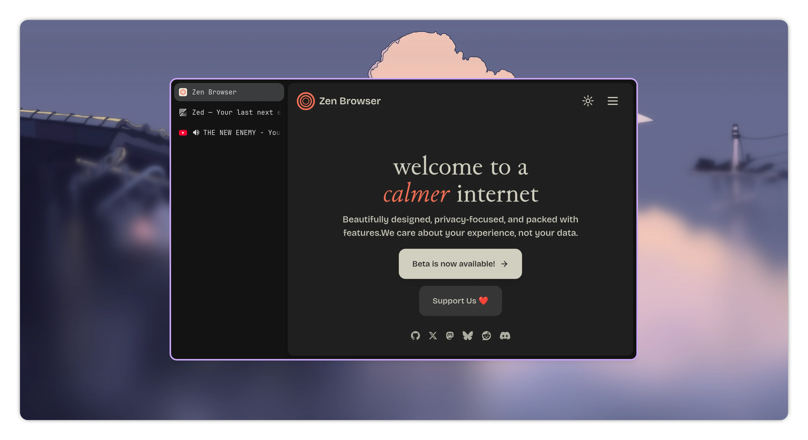
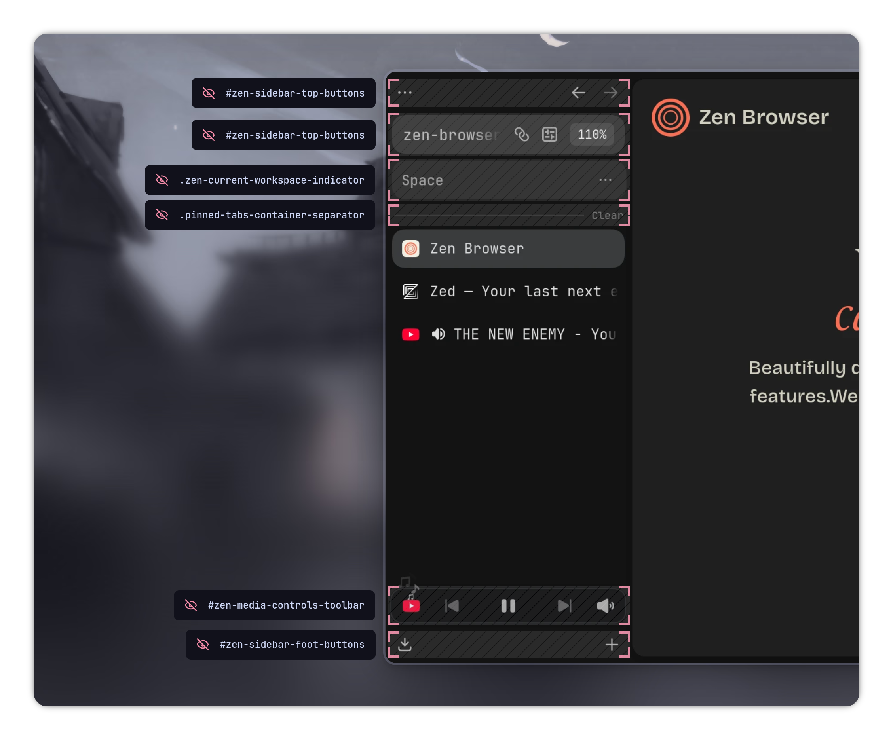

<h1 align="center">
    <strong><i>Zen &lt; 0</i></strong>
</h1>

<p align="center"><i>Custom CSS for Zen Browser. It's empty so it is.</i></p>



<div align="center">
    🫥 &ensp;•&ensp; 💔 &ensp;•&ensp; ✨
</div>

&nbsp;

<p align="center"><i>Zen is minimal by default. But we can move one step further</i> 🤓</p>



&nbsp;

## _**Motivation**_ 🫸

Modern features and dense UI not quite interesting. So hide it.

&nbsp;

## _**Quick setup**_ 🏃‍➡️

Here's short version of _[userChrome.css](userChrome.css)_ with comments removed. Copy and paste it to yours. _**DONE!**_

```css
#zen-sidebar-top-buttons,
#zen-sidebar-foot-buttons,
#zen-overflow-extensions-list,
#zen-essentials,
#zen-media-controls-toolbar,
.zen-current-workspace-indicator,
.pinned-tabs-container-separator {
    visibility: collapse;
}

#nav-bar {
    position: absolute !important;
    margin-top: -99px;
}

#titlebar {
    padding-top: 4px !important;
}
```

&nbsp;

## _**Full setup**_ 🧭

**Step 1:** Turn on _[Live Editing](https://docs.zen-browser.app/guides/live-editing)_ feature.

**Step 2:** Copy it _[userChrome.css](userChrome.css)_ and done.

&nbsp;

## _**Extra**_ 🎁

### _**Hide window controls**_ 🗕 🗖 🗙

Enter `about:config` and set `zen.view.experimental-no-window-controls` to `true`.
